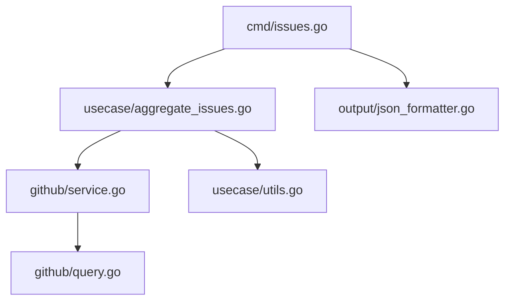

# 設計書

- 最終更新日: `2025-11-22`
- バージョン: `8b307c5`

## 概要

イシュー集計機能は、GitHub GraphQL APIを使用してイシューデータを収集し、期間・状態でフィルタリングした結果をJSON形式で出力するコマンドラインツールです。既存のPR集計機能（`merged-pr`コマンド）と同じCLIツール内に新しいコマンドとして追加し、同様のアーキテクチャパターンに従って実装されます。

## ステアリングドキュメントとの整合性

### 技術選定 (tech.md)

- **GitHub GraphQL API v4**: イシューデータの効率的な取得
- **Go標準ライブラリ**: JSONエンコーディング、時刻処理
- **github.com/cli/go-gh/v2**: GitHub CLI統合
- **github.com/spf13/cobra**: CLIコマンド構造の実装

### 構造 (structure.md)

Clean Architectureの層構造に従い、以下のように実装：
- **cmd層**: ユーザー入力の処理とコマンド実行（`cmd/issues.go`）
- **usecase層**: ビジネスロジックとデータ処理（`internal/usecase/aggregate_issues.go`）
- **github層**: GraphQL APIとの通信（`internal/github/`）
- **output層**: JSON出力フォーマット（`internal/output/json_formatter.go`を再利用）

## 詳細設計

### データモデル・インターフェイス

各レイヤーごとにデータモデルとインターフェイスを定義し、責任を明確に分離する。

### GitHub層（internal/github）

#### ListIssuesResponse型

`listIssueAndProjectFieldsQuery`のGraphQLレスポンスをマッピングする構造体。githubパッケージ内でのみ使用するプライベートな型。

```go
// listIssueAndProjectFieldsQueryのレスポンス構造
type listIssuesResponse struct {
    Repository struct {
        Issues struct {
            TotalCount int `json:"totalCount"`
            PageInfo   struct {
                HasNextPage bool   `json:"hasNextPage"`
                EndCursor   string `json:"endCursor"`
            } `json:"pageInfo"`
            Nodes []issueNode `json:"nodes"`
        } `json:"issues"`
    } `json:"repository"`
}

// イシューノードの構造（プロジェクトフィールドを含む）
type issueNode struct {
    ID        string        `json:"id"`
    Number    int          `json:"number"`
    Title     string       `json:"title"`
    State     string       `json:"state"`
    CreatedAt time.Time    `json:"createdAt"`
    UpdatedAt time.Time    `json:"updatedAt"`
    ClosedAt  *time.Time   `json:"closedAt"`
    Author    struct {
        Login string `json:"login"`
    } `json:"author"`
    Assignees struct {
        Nodes []struct {
            Login string `json:"login"`
        } `json:"nodes"`
    } `json:"assignees"`
    Labels struct {
        Nodes []struct {
            Name string `json:"name"`
        } `json:"nodes"`
    } `json:"labels"`
    Milestone *struct {
        Title  string `json:"title"`
        Number int    `json:"number"`
    } `json:"milestone"`
    ProjectItems struct {
        TotalCount int `json:"totalCount"`
        Nodes      []struct {
            ID        string `json:"id"`
            CreatedAt string `json:"createdAt"`
            UpdatedAt string `json:"updatedAt"`
            Project   struct {
                ID     string `json:"id"`
                Number int    `json:"number"`
                Title  string `json:"title"`
            } `json:"project"`
            FieldValues struct {
                Nodes []interface{} `json:"nodes"` // 各種フィールド値の動的な型
            } `json:"fieldValues"`
        } `json:"nodes"`
    } `json:"projectItems"`
}
```

### UseCase層（internal/usecase）

#### AggregateIssuesInput型

イシュー集計処理への入力パラメータ。コマンドライン引数から取得した値を保持する。

```go
type AggregateIssuesInput struct {
    Owner  string
    Repo   string
    Since  string  // YYYY-MM-DD形式
    Until  string  // YYYY-MM-DD形式
    State  string  // "open", "closed", "all"
    Limit  int
}
```

#### AggregateIssuesOutput型

イシュー集計処理の出力結果。期間、リポジトリ情報、総数、個別のイシューメトリクスを含む。

```go
type AggregateIssuesOutput struct {
    Period     Period        `json:"period"`
    Repository Repository    `json:"repository"`
    TotalCount int          `json:"total_count"`
    Issues     []IssueMetric `json:"issues"`
}
```

#### IssueMetric型

ユーザーに出力するためのイシュー集計データ。Issue型から変換され、週・月の計算値やプロジェクトフィールド値を含む。

```go
type IssueMetric struct {
    Number              int                    `json:"number"`
    Title               string                 `json:"title"`
    State               string                 `json:"state"`
    CreatedAt           time.Time             `json:"created_at"`
    CreatedWeek         string                `json:"created_week"`  // ISO 8601形式（例: "2025-W40"）
    CreatedMonth        string                `json:"created_month"` // YYYY-MM形式
    UpdatedAt           time.Time             `json:"updated_at"`
    ClosedAt            *time.Time            `json:"closed_at"`
    ClosedWeek          *string               `json:"closed_week"`
    ClosedMonth         *string               `json:"closed_month"`
    Author              string                `json:"author"`
    Assignees           []string              `json:"assignees"`
    Labels              []string              `json:"labels"`
    Milestone           *string               `json:"milestone"`
    ProjectFieldValues  []ProjectFieldValue   `json:"project_field_values"`
}
```

#### ProjectFieldValue型

GitHubプロジェクトのカスタムフィールド値を表す構造体。フィールド名、型、値を保持する。

```go
type ProjectFieldValue struct {
    FieldName  string `json:"field_name"`
    FieldType  string `json:"field_type"`
    Value      string `json:"value"`
}
```

#### Period型とRepository型

期間とリポジトリ情報を表す補助的な構造体。

```go
type Period struct {
    Start string `json:"start"`
    End   string `json:"end"`
}

type Repository struct {
    Owner string `json:"owner"`
    Name  string `json:"name"`
}
```

### パッケージ設計



#### 責任分担

1. **cmd/issues.go**
   - コマンドライン引数の解析
   - バリデーション（日付形式、stateの値）
   - usecaseの呼び出し
   - 出力フォーマッターの呼び出し

2. **usecase/aggregate_issues.go**
   - GitHub APIサービスの呼び出し
   - Issue型からIssueMetric型への変換
   - 週・月の計算
   - プロジェクトフィールド値の整形

3. **github/service.go（既存を拡張）**
   - GraphQLクエリの実行
   - ページネーション処理
   - エラーハンドリング

4. **github/query.go（既存を拡張）**
   - issuesStatsQueryの定義（既に追加済み）
   - 検索クエリビルダーの拡張

### エラーハンドリング

#### エラーシナリオ 1: リポジトリが見つからない

- GraphQL APIから404エラーが返される
- 標準エラー出力に「Repository not found: owner/repo」を表示
- exit code 1で終了

#### エラーシナリオ 2: 認証エラー

- GitHub CLIの認証が失敗
- 標準エラー出力に「Authentication failed. Please run 'gh auth login'」を表示
- exit code 1で終了

#### エラーシナリオ 3: APIレート制限

- GitHub APIのレート制限に到達
- 標準エラー出力に「API rate limit exceeded. Please wait and try again.」を表示
- リセット時刻の情報を含める
- exit code 1で終了

#### エラーシナリオ 4: 不正な日付形式

- Since/Untilパラメータが不正な形式
- 標準エラー出力に「Invalid date format. Use YYYY-MM-DD format.」を表示
- exit code 1で終了

#### エラーシナリオ 5: ネットワークエラー

- ネットワーク接続の問題でAPIアクセス失敗
- 標準エラー出力に「Network error: [詳細なエラーメッセージ]」を表示
- exit code 1で終了

#### 上記以外の予期せぬエラーが発生した場合

- exit code 1で終了し、標準エラー出力にエラーメッセージを表示する


## テスト戦略

### ユニットテスト

- **usecase/aggregate_issues_test.go**: ビジネスロジックのテスト
  - Issue→IssueMetric変換のテスト
  - 週・月計算ロジックのテスト
  - プロジェクトフィールド値の整形テスト

### 結合テスト

- **cmd/issues_test.go**: コマンド実行のテスト
  - 各種パラメータの組み合わせテスト
  - エラーケースのテスト
  - 出力形式の検証

### E2Eテスト

手動テストシナリオ：
1. デフォルトパラメータでの実行
2. 期間指定での実行
3. state指定（open/closed/all）での実行
4. limit指定での実行
5. 現在のリポジトリでの実行（owner/repo省略）