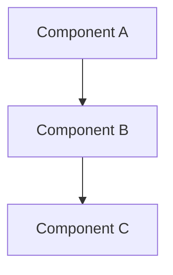

[Think about what to document while talking to the designer. Don't ask the designer for answers; just make decisions through discussion.]

# 設計書

- 最終更新日: `{{date}}`
- バージョン: `{{commitHash}}` [the latest commit hash at the time of document creation]

## 概要

[High-level description of the feature and its place in the overall system]

## ステアリングドキュメントとの整合性

### 技術選定 (tech.md)

[How the design follows documented technical patterns and standards]

### 構造 (structure.md)

[How the implementation will follow project organization conventions]

## 詳細設計

[Describe the overall architecture and design patterns used]

### データモデル・インターフェイス

[Describe the core data models and interfaces, their properties, and relationships by layer]

### [Layer 1]

#### [Model 1]

[Describe what this model represents and its role in the system]

```go
type Model1 struct {
    ID   int    `json:"id"`
    Name string `json:"name"`
    // [Additional properties as needed]
}
```

[Additional models or layer if necessary]

### パッケージ設計

[Describe the package/module structure and their responsibilities]



### エラーハンドリング

[Describe how errors will be handled, including specific scenarios and user impact]

#### エラーシナリオ 1 [Describe the error scenario]

- [How to handle it and what the user sees]

[Additional error scenarios if necessary]

#### 上記以外の予期せぬエラーが発生した場合

- exit code 1 で終了し、標準エラー出力にエラーメッセージを表示する

## テスト戦略

### ユニットテスト

- [Unit testing approach]
- [Key components to test]

### 結合テスト

- [Integration testing approach]
- [Key flows to test]

### E2E テスト

- [E2E testing approach]
- [User scenarios to test]
